# SanHub - AI 内容生成平台

## 变更记录 (Changelog)

| 日期 | 版本 | 变更内容 |
|------|------|----------|
| 2026-02-22 | 2.3.0 | Phase 7 类型债务清理：新增 lib/db-types.ts (DbRow + getAffectedRows)；更新 db-adapter 接口返回类型；清理 db.ts/db-codes.ts/db-agent.ts/db-llm.ts 共 100+ 处 as any 至 1 处 |
| 2026-02-20 | 2.2.0 | 补扫 app/api/projects/（13 个路由）和 app/api/assets/（6 个路由）模块 |
| 2026-02-20 | 2.1.0 | 补扫 app/api/admin/ 模块（31 个路由文件，12 个功能分类） |
| 2026-02-20 | 2.0.0 | 全量增量扫描：新增 assets/workspace/workflow/generator/layout 模块文档；更新 lib/episodes/admin 模块；新增 Agent 系统、AI 分镜、素材分析、即梦 API、任务调度等 |
| 2026-02-06 | 1.2.0 | 补扫 lib/、components/projects/、components/admin/ 模块 |
| 2026-02-06 | 1.1.0 | 补扫 components/ui、components/episodes、app/api/generate 模块 |
| 2026-02-06 | 1.0.0 | 初始化架构文档 |

---

## 项目愿景

SanHub 是一个一站式 AI 创作平台，融合了 OpenAI Sora 视频生成、Google Gemini 图像创作、多渠道图像生成以及多模型 AI 对话功能。平台提供用户管理、积分系统、邀请码机制、漫剧项目工作台和完整的后台管理功能。

---

## 架构总览

- **框架**: Next.js 14 (App Router)
- **语言**: TypeScript
- **数据库**: SQLite / MySQL (可配置，通过 db-adapter 适配)
- **认证**: NextAuth.js (Credentials Provider, JWT)
- **状态管理**: Zustand (workspace-store)
- **样式**: Tailwind CSS + Radix UI
- **AI 服务**: OpenAI Sora, Google Gemini, KIE-AI, 速创, 即梦, ModelScope, Gitee
- **部署**: Docker / Standalone
- **邮件**: Nodemailer (SMTP)

---

## 模块结构图 (Mermaid)

```mermaid
graph TD
    A["(根) SanHub"] --> B["app"]
    A --> C["lib"]
    A --> D["components"]
    A --> E["types"]

    B --> B1["(auth)"]
    B --> B2["(dashboard)"]
    B --> B3["admin"]
    B --> B4["api"]
    B4 --> B4a["generate"]
    B4 --> B4b["admin"]
    B4 --> B4c["projects"]
    B4 --> B4d["episodes"]
    B4 --> B4e["assets"]
    B2 --> B2a["create"]
    B2 --> B2b["projects"]
    B2 --> B2c["history"]

    C --> C1["stores"]
    C --> C2["hooks"]
    C --> C3["constants"]

    D --> D1["ui"]
    D --> D2["workspace"]
    D --> D3["workflow"]
    D --> D4["episodes"]
    D --> D5["projects"]
    D --> D6["admin"]
    D --> D7["assets"]
    D --> D8["generator"]
    D --> D9["layout"]
    D --> D10["providers"]

    click C "./lib/CLAUDE.md" "查看核心库文档"
    click D1 "./components/ui/CLAUDE.md" "查看 UI 组件库文档"
    click D2 "./components/workspace/CLAUDE.md" "查看工作区模块文档"
    click D3 "./components/workflow/CLAUDE.md" "查看工作流模块文档"
    click D4 "./components/episodes/CLAUDE.md" "查看剧集管理模块文档"
    click D5 "./components/projects/CLAUDE.md" "查看项目管理模块文档"
    click D6 "./components/admin/CLAUDE.md" "查看后台管理模块文档"
    click D7 "./components/assets/CLAUDE.md" "查看素材管理模块文档"
    click D8 "./components/generator/CLAUDE.md" "查看生成器模块文档"
    click D9 "./components/layout/CLAUDE.md" "查看布局模块文档"
    click B4a "./app/api/generate/CLAUDE.md" "查看生成 API 文档"
    click B4b "./app/api/admin/CLAUDE.md" "查看管理 API 文档"
    click B4c "./app/api/projects/CLAUDE.md" "查看项目 API 文档"
    click B4e "./app/api/assets/CLAUDE.md" "查看素材 API 文档"
```



---

## 模块索引

| 模块路径 | 职责 | 入口文件 | 文档 |
|----------|------|----------|------|
| `app/` | Next.js App Router 页面与 API 路由 | `app/layout.tsx` | - |
| `app/(auth)/` | 认证页面（登录、注册、重置密码） | `app/(auth)/login/page.tsx` | - |
| `app/(dashboard)/` | 仪表盘页面（创作、项目、历史、设置） | `app/(dashboard)/layout.tsx` | - |
| `app/(dashboard)/create/` | 统一 AI 创作页面（图像+视频） | `app/(dashboard)/create/page.tsx` | - |
| `app/admin/` | 后台管理页面（26 个子页面） | `app/admin/layout.tsx` | - |
| `app/api/generate/` | AI 内容生成 API | `app/api/generate/image/route.ts` | [CLAUDE.md](./app/api/generate/CLAUDE.md) |
| `app/api/admin/` | 后台管理 API（用户、模型、渠道、Agent 等，31 个路由） | `app/api/admin/settings/route.ts` | [CLAUDE.md](./app/api/admin/CLAUDE.md) |
| `app/api/projects/` | 项目管理 API（CRUD、成员、邀请、剧集、素材，13 个路由） | `app/api/projects/route.ts` | [CLAUDE.md](./app/api/projects/CLAUDE.md) |
| `app/api/episodes/` | 剧集 API（CRUD、分镜、素材） | - | - |
| `app/api/assets/` | 素材 API（CRUD、图片生成/上传/导出，6 个路由） | `app/api/assets/[assetId]/route.ts` | [CLAUDE.md](./app/api/assets/CLAUDE.md) |
| `lib/` | 核心业务逻辑库（62 个文件） | `lib/db.ts` | [CLAUDE.md](./lib/CLAUDE.md) |
| `components/ui/` | 基础 UI 组件库 | `components/ui/button.tsx` | [CLAUDE.md](./components/ui/CLAUDE.md) |
| `components/layout/` | 应用布局组件 | `components/layout/dashboard-shell.tsx` | [CLAUDE.md](./components/layout/CLAUDE.md) |
| `components/workflow/` | 工作流外壳 | `components/workflow/workflow-shell.tsx` | [CLAUDE.md](./components/workflow/CLAUDE.md) |
| `components/workspace/` | 工作区中心面板 | `components/workspace/workspace-center-panel.tsx` | [CLAUDE.md](./components/workspace/CLAUDE.md) |
| `components/episodes/` | 剧集管理组件 | `components/episodes/dynamic-workspace.tsx` | [CLAUDE.md](./components/episodes/CLAUDE.md) |
| `components/assets/` | 素材管理组件（20 个文件） | `components/assets/asset-workspace.tsx` | [CLAUDE.md](./components/assets/CLAUDE.md) |
| `components/projects/` | 项目管理组件 | `components/projects/project-list.tsx` | [CLAUDE.md](./components/projects/CLAUDE.md) |
| `components/generator/` | 生成器 UI 组件 | `components/generator/sora-panel.tsx` | [CLAUDE.md](./components/generator/CLAUDE.md) |
| `components/admin/` | 后台管理组件（含 Agent 编辑器） | `components/admin/sidebar.tsx` | [CLAUDE.md](./components/admin/CLAUDE.md) |
| `components/providers/` | Context Provider（Debug、SiteConfig） | `components/providers.tsx` | - |
| `types/` | TypeScript 类型定义 | `types/index.ts` | - |

---

## 运行与开发

### 环境要求
- Node.js >= 18
- pnpm / npm / yarn

### 安装依赖
```bash
npm install
```

### 开发模式
```bash
npm run dev
```

### 生产构建
```bash
npm run build
npm run start
```

### Docker 部署
```bash
docker-compose up -d
```

### 环境变量
复制 `.env.example` 为 `.env.local` 并配置:

| 变量名 | 说明 | 必填 |
|--------|------|------|
| `NEXTAUTH_URL` | 应用 URL | 是 |
| `NEXTAUTH_SECRET` | NextAuth 密钥 | 是 |
| `DB_TYPE` | 数据库类型 (sqlite/mysql) | 否 |
| `ADMIN_EMAIL` | 初始管理员邮箱 | 是 |
| `ADMIN_PASSWORD` | 初始管理员密码 | 是 |

---

## 测试策略

**当前状态**: 项目暂无测试文件

**建议**:
- 添加 Jest + React Testing Library 进行单元测试
- 添加 Playwright/Cypress 进行 E2E 测试
- 优先覆盖 `lib/` 目录下的核心业务逻辑
- 优先覆盖 `api-handler.ts` 的权限控制逻辑

---

## 编码规范

- **ESLint**: 使用 `eslint-config-next` 配置
- **TypeScript**: 严格模式
- **命名约定**:
  - 组件: PascalCase (`UserCard.tsx`)
  - 工具函数: camelCase (`generateId`)
  - 类型: PascalCase (`UserRole`)
  - API 路由: kebab-case (`/api/user-groups`)
- **Middleware**: Edge Runtime，不可直接访问数据库

---

## AI 使用指引

### 代码修改注意事项

1. **数据库操作**: 所有数据库操作通过 `lib/db.ts`、`lib/db-adapter.ts`、`lib/db-comic.ts`、`lib/db-agent.ts`、`lib/db-llm.ts`、`lib/db-codes.ts` 进行，支持 SQLite 和 MySQL 双数据库
2. **认证检查**: API 路由需使用 `getServerSession(authOptions)` 或 `createHandler`/`adminHandler`/`authHandler` 进行认证
3. **类型安全**: 所有类型定义在 `types/index.ts` 和 `types/debug.ts`，修改时需同步更新
4. **API 响应格式**: 统一使用 `{ success: boolean, data?: T, error?: string }` 格式

### LLM 调用规范

所有 LLM 文本生成必须通过 `lib/llm-client.ts` 的 `generateLlmText()` 函数：
- 自动跟随后台模型管理的 maxTokens/temperature 设置
- 统一 token 消耗计算（Gemini 修正 completionTokens = total - prompt）
- 统一请求/响应日志
- 支持 Gemini 和 OpenAI-compatible 双 provider
- 支持 thinking/reasoning 模型（`reasoningText` 字段）

禁止在业务代码中直接 fetch LLM API。

### Agent 提示词系统

- Agent 配置通过 `lib/db-agent.ts` 管理，支持版本控制
- 提示词获取通过 `lib/prompt-service.ts`，优先 Agent -> fallback llm_prompts -> 代码默认值
- Agent 配置编译通过 `lib/agent-utils.ts` 的 `compileSystemPrompt()`
- JSON Schema 通过 `lib/schema-registry.ts` 注册

### 关键文件

| 文件 | 用途 |
|------|------|
| `lib/db.ts` | 数据库操作核心 |
| `lib/db-comic.ts` | 漫剧项目/剧集/素材操作 |
| `lib/db-agent.ts` | Agent CRUD |
| `lib/auth.ts` | NextAuth 配置 |
| `lib/image-generator.ts` | 统一图像生成入口 |
| `lib/video-generator.ts` | 统一视频生成入口 |
| `lib/llm-client.ts` | LLM 调用客户端 |
| `lib/sora-api.ts` | Sora 视频 API |
| `lib/ai-storyboard-service.ts` | AI 分镜服务 |
| `lib/asset-analyzer.ts` | 素材分析服务 |
| `lib/feature-binding.ts` | 功能绑定解析 |
| `lib/prompt-service.ts` | 提示词模板服务 |
| `lib/task-scheduler.ts` | 任务调度器 |
| `lib/api-handler.ts` | API 路由处理器 |
| `lib/db-types.ts` | 数据库类型定义 (DbRow, getAffectedRows) |
| `lib/stores/workspace-store.ts` | 工作区状态管理 |
| `middleware.ts` | Edge 中间件（路由重定向） |
| `types/index.ts` | 全局类型定义 |

### API 路由分类

| 分类 | 路径前缀 | 说明 |
|------|----------|------|
| 认证 | `/api/auth/` | 登录、注册、发送验证码、NextAuth |
| 管理 | `/api/admin/` | 后台管理接口（用户、模型、渠道、Agent、用户组等） |
| 生成 | `/api/generate/` | 图像/视频/角色卡生成 |
| 用户 | `/api/user/` | 用户相关操作（密码、历史、角色卡、任务） |
| 项目 | `/api/projects/` | 项目管理（CRUD、成员、邀请、素材） |
| 剧集 | `/api/episodes/` | 剧集管理（CRUD、分镜、素材） |
| 素材 | `/api/assets/` | 素材管理（CRUD、图片生成/上传/导出） |
| 状态 | `/api/status/` | 任务状态轮询 |
| 配置 | `/api/site-config/`, `/api/config/` | 站点配置 |
| Webhook | `/api/webhook/` | 外部回调（KIE-AI） |

---

## 数据模型

### 核心表结构

| 表名 | 说明 |
|------|------|
| `users` | 用户信息 |
| `generations` | 生成记录 |
| `system_config` | 系统配置 |
| `image_channels` | 图像渠道配置 |
| `image_models` | 图像模型配置 |
| `video_channels` | 视频渠道配置 |
| `video_models` | 视频模型配置 |
| `llm_models` | LLM 模型配置 |
| `llm_agents` | Agent 提示词配置 |
| `llm_agent_versions` | Agent 版本历史 |
| `feature_bindings` | 功能绑定 |
| `workspaces` | 工作空间 |
| `character_cards` | 角色卡 |
| `user_groups` | 用户组 |
| `art_styles` | 画风配置 |
| `comic_projects` | 漫剧项目 |
| `comic_episodes` | 漫剧剧集 |
| `project_assets` | 项目素材 |
| `asset_occurrences` | 素材出现记录 |

---

## 功能模块说明

### 1. 图像生成
- 支持多渠道: OpenAI Compatible, Gemini, ModelScope, Gitee, Sora
- 统一入口: `lib/image-generator.ts`
- 支持文生图、图生图、超分辨率、抠图
- 智能模型选择: `lib/image-model-selector.ts`

### 2. 视频生成
- 支持 Sora API (OpenAI 格式)
- 支持 KIE-AI、速创、即梦等渠道
- 异步轮询机制 (`lib/backend-poller.ts`)
- 任务调度 (`lib/task-scheduler.ts`)

### 3. 漫剧工作台
- 项目管理: 创建、复制、删除、成员邀请
- 剧集管理: 创建、拆分、编辑、排序
- AI 分镜: `lib/ai-storyboard-service.ts`
- 素材分析: `lib/asset-analyzer.ts`（角色、场景、道具提取）
- 素材管理: 图片生成、上传、历史、导出
- 工作区状态: `lib/stores/workspace-store.ts`

### 4. Agent 提示词系统
- 可视化 Agent 编辑器（角色、规则、工作流、示例、格式）
- 版本控制与回滚
- 功能绑定（将 Agent 绑定到 LLM/图像/视频模型）
- 提示词模板渲染

### 5. 用户系统
- 角色: admin, moderator, user
- 积分系统
- 邀请码 & 卡密兑换
- 用户组与权限
- 邮箱验证（SMTP）
