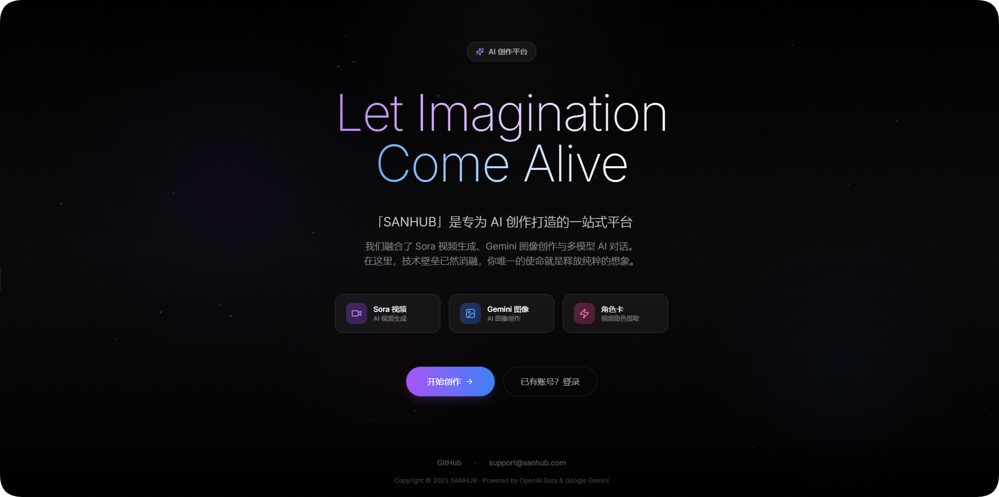
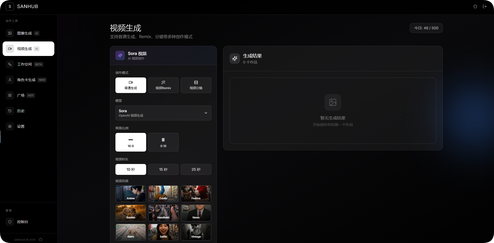
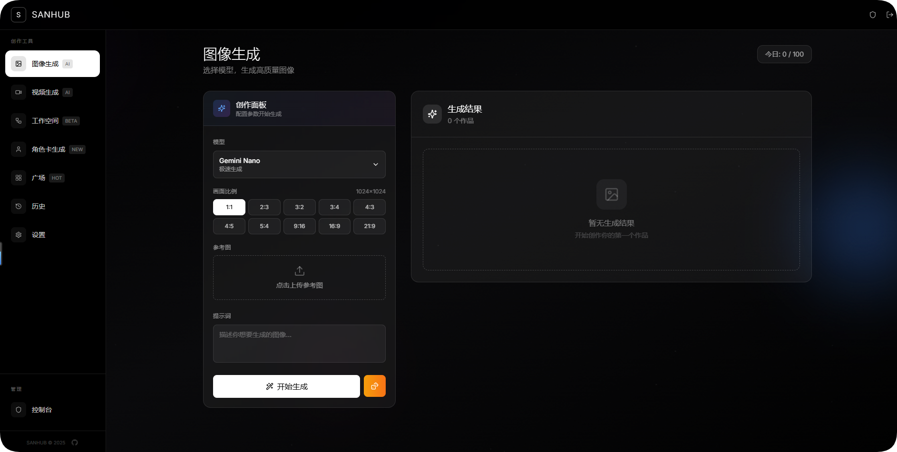
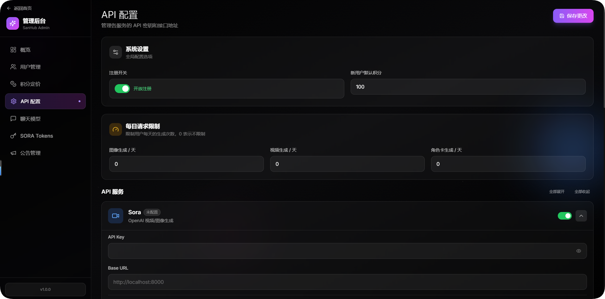

# SanHub - AI 内容生成平台

<p align="center">
  
  
  
  
</p>

<p align="center">
  一站式 AI 创作平台，提供图像生成、视频生成、漫剧工作台、多模型 AI 对话和完整的后台管理功能。
</p>

---

## ✨ 功能特性

### 🎬 视频生成
- Sora 视频生成（多时长、多比例）
- 支持 KIE-AI、速创、即梦等多渠道
- 参考图/视频驱动生成
- 异步任务调度与状态轮询

### 🎨 图像生成
- 多渠道统一入口：OpenAI Compatible、Gemini、ModelScope、Gitee、Sora
- 支持文生图、图生图、超分辨率、抠图
- 智能模型选择与渠道路由
- 风格迁移与编辑

### 📖 漫剧工作台
- 项目管理：创建、复制、删除、成员邀请
- 剧集管理：创建、拆分、编辑、排序
- AI 分镜：自动生成分镜脚本
- 素材分析：角色、场景、道具智能提取
- 素材管理：图片生成、上传、历史、导出
- 工作区状态管理（Zustand）

### 🤖 Agent 提示词系统
- 可视化 Agent 编辑器（角色、规则、工作流、示例、格式）
- 版本控制与回滚
- 功能绑定（将 Agent 绑定到 LLM/图像/视频模型）
- 提示词模板渲染与 JSON Schema 注册

### 💬 多模型 AI 对话
- 统一 LLM 调用客户端（支持 Gemini + OpenAI Compatible）
- 后台模型管理（maxTokens / temperature）
- 统一 token 消耗计算与日志
- 支持 thinking/reasoning 模型

### 📝 提示词模板
- 11 种预设创作模板
- 3x3 电影镜头图、分镜故事板
- 角色情绪板、场景概念图
- 剧本大纲、场景对话生成

### 🎤 角色卡
- 视频驱动角色创建
- 自动提取角色头像
- 角色库管理

### 🛠️ 后台管理
- 用户管理与权限控制（admin / moderator / user）
- 图像渠道 & 模型管理
- 视频渠道 & 模型管理
- LLM 模型管理
- Agent 提示词管理
- 用户组与权限
- 积分系统 & 渠道内模型独立定价
- 邀请码 & 卡密兑换
- 系统公告、站点配置、安全设置
- PicUI 图床集成

### 🔐 安全特性
- NextAuth.js 认证（Credentials Provider, JWT）
- 邮箱验证码（SMTP）
- 请求频率限制（支持 Redis）
- 用户禁用机制
- Edge 中间件路由保护

---

## 🛠️ 技术栈

| 类别 | 技术 |
|------|------|
| **框架** | Next.js 14 (App Router) |
| **语言** | TypeScript |
| **样式** | TailwindCSS + Radix UI |
| **状态管理** | Zustand |
| **数据请求** | TanStack React Query |
| **认证** | NextAuth.js |
| **数据库** | SQLite / MySQL（可切换，通过 db-adapter 适配） |
| **邮件** | Nodemailer (SMTP) |
| **测试** | Vitest |
| **部署** | Docker / Standalone |

---

## 🚀 快速开始

### 方式一：Docker 部署（推荐）

```bash
git clone https://github.com/wyyyglj-dot/san.git && cd san && docker-compose up -d
```

启动后访问 http://localhost:3000

| 项目 | 值 |
|------|-----|
| 默认管理员邮箱 | `admin@example.com` |
| 默认管理员密码 | `change-this-password` |

> ⚠️ **首次登录后请立即修改密码！**

**常用命令：**

```bash
docker-compose logs -f           # 查看日志
docker-compose down              # 停止服务
docker-compose up -d --build     # 重新构建
```

**生产环境部署：**

编辑 `docker-compose.yml`，配置：

```yaml
environment:
  - NEXTAUTH_URL=https://your-domain.com
  - ADMIN_EMAIL=admin@example.com
  - ADMIN_PASSWORD=your-secure-password
```

---

### 方式二：本地开发

```bash
# 1. 克隆项目
git clone https://github.com/wyyyglj-dot/san.git
cd san

# 2. 安装依赖
npm install

# 3. 配置环境变量
cp .env.example .env.local
# 编辑 .env.local，至少设置 NEXTAUTH_SECRET 和 ADMIN_EMAIL/ADMIN_PASSWORD

# 4. 启动开发服务器
npm run dev
```

访问 http://localhost:3000，首次运行会自动创建数据库和管理员账号。

---

## 💾 数据库选择

| 类型 | 优势 | 适用场景 |
|------|------|----------|
| **SQLite** | 零配置、开箱即用 | 开发环境、小规模部署 |
| **MySQL** | 高并发、多实例支持 | 生产环境 |

切换数据库只需修改 `.env.local`：

```env
# SQLite（默认）
DB_TYPE=sqlite

# MySQL
DB_TYPE=mysql
MYSQL_HOST=localhost
MYSQL_PORT=3306
MYSQL_USER=sanhub
MYSQL_PASSWORD=your-mysql-password
MYSQL_DATABASE=sanhub
```

---

## 📁 项目结构

```
san/
├── app/
│   ├── (auth)/                # 登录 / 注册 / 重置密码
│   ├── (dashboard)/           # 用户面板
│   │   ├── create/            # 统一 AI 创作页面（图像+视频）
│   │   ├── projects/          # 漫剧项目管理
│   │   ├── history/           # 历史记录
│   │   ├── settings/          # 用户设置
│   │   ├── image/             # 图像生成
│   │   └── video/             # 视频生成 & 角色卡
│   ├── admin/                 # 管理后台（23 个子页面）
│   │   ├── agents/            # Agent 提示词管理
│   │   ├── llm-models/        # LLM 模型管理
│   │   ├── image-channels/    # 图像渠道管理
│   │   ├── video-channels/    # 视频渠道管理
│   │   ├── users/             # 用户管理
│   │   ├── user-groups/       # 用户组管理
│   │   ├── pricing/           # 定价管理
│   │   ├── invites/           # 邀请码管理
│   │   ├── redemption/        # 卡密兑换
│   │   └── ...                # 公告、站点、安全、统计等
│   └── api/                   # API 路由
│       ├── generate/          # 图像 / 视频 / 角色卡生成
│       ├── admin/             # 后台管理 API（31 个路由）
│       ├── projects/          # 项目管理 API（13 个路由）
│       ├── episodes/          # 剧集管理 API
│       └── assets/            # 素材管理 API（6 个路由）
├── components/
│   ├── ui/                    # 基础 UI 组件库
│   ├── workspace/             # 工作区中心面板
│   ├── workflow/              # 工作流外壳
│   ├── episodes/              # 剧集管理组件
│   ├── assets/                # 素材管理组件（20 个文件）
│   ├── projects/              # 项目管理组件
│   ├── generator/             # 生成器 UI 组件
│   ├── admin/                 # 后台管理组件（含 Agent 编辑器）
│   ├── layout/                # 布局组件
│   └── providers/             # Context Provider
├── lib/                       # 核心业务逻辑库（62 个文件）
│   ├── db.ts                  # 数据库操作核心
│   ├── db-adapter.ts          # 数据库适配器（SQLite/MySQL）
│   ├── db-comic.ts            # 漫剧项目/剧集/素材操作
│   ├── db-agent.ts            # Agent CRUD
│   ├── db-llm.ts              # LLM 模型操作
│   ├── auth.ts                # NextAuth 配置
│   ├── image-generator.ts     # 统一图像生成入口
│   ├── video-generator.ts     # 统一视频生成入口
│   ├── llm-client.ts          # LLM 调用客户端
│   ├── ai-storyboard-service.ts  # AI 分镜服务
│   ├── asset-analyzer.ts      # 素材分析服务
│   ├── prompt-service.ts      # 提示词模板服务
│   ├── task-scheduler.ts      # 任务调度器
│   ├── api-handler.ts         # API 路由处理器
│   └── stores/                # Zustand 状态管理
├── data/
│   ├── media/                 # 媒体文件存储
│   └── prompts/               # 提示词模板（11 个）
├── types/                     # TypeScript 类型定义
└── docs/                      # 文档
```

---

## 📖 环境变量

详见 [.env.example](./.env.example) 文件，包含所有可配置项及说明。

核心变量：

| 变量名 | 说明 | 必填 |
|--------|------|------|
| `NEXTAUTH_URL` | 应用 URL | 是 |
| `NEXTAUTH_SECRET` | NextAuth 密钥 | 是 |
| `DB_TYPE` | 数据库类型 (sqlite/mysql) | 否 |
| `ADMIN_EMAIL` | 初始管理员邮箱 | 是 |
| `ADMIN_PASSWORD` | 初始管理员密码 | 是 |

---

## 📸 截图预览

<details>
<summary>点击展开截图</summary>

### 首页


### 视频生成


### 图像生成


### 管理后台


</details>

---

## 🤝 贡献

欢迎提交 Issue 和 Pull Request！

## 📄 许可证

[MIT License](./LICENSE)
